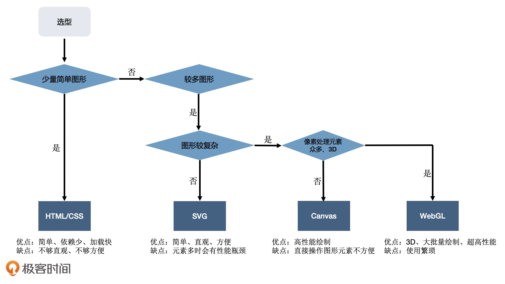
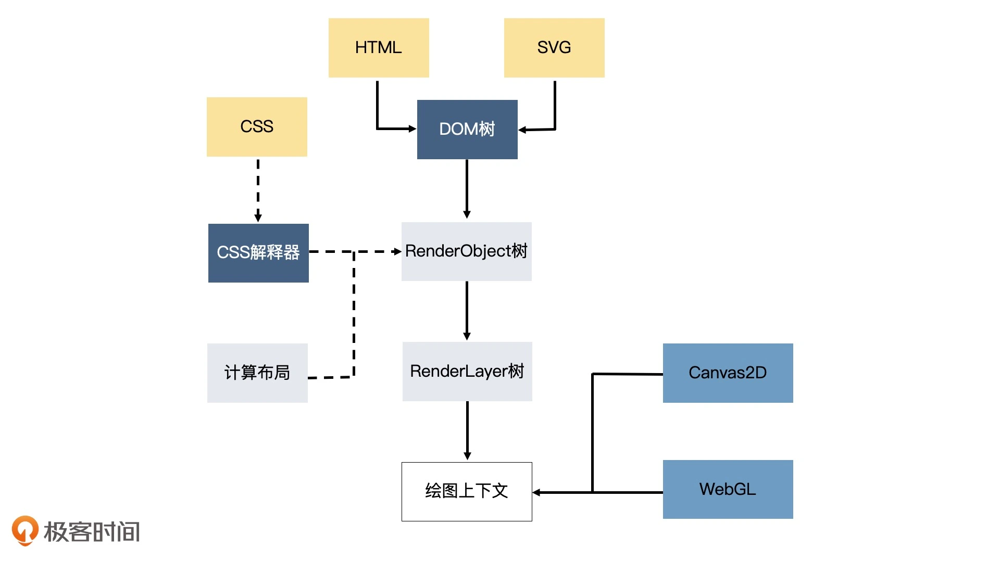

# 浏览器中实现可视化的四种方式

渲染引擎绘制图形的 4 种方法

1. Html + css
2. svg
3. canvas2D 浏览器提供的 Canvas API 中的其中一种上下文。
4. WebGL 浏览器中提供的 Canvas API 中的另一种上下文。它是 OpenGL ES 规范在 Web 端的实现。

WebGL 利用了 GPU 并行处理的特性，在大量数据展示的时候，性能大大优于前 3 种绘图方式。

## Html + css 实现可视化的缺点

1. css 代码里很难看出数据与图形的对应关系。一旦数据变动，需要重新计算，难以维护。
2. 其作为浏览器渲染引擎的一部分，除了绘制图形外，还要做很多额外的工作。先解析 HTML、SVG、CSS，构建 DOM 树、RenderObject 树和 RenderLayer 树，然后用 HTML（或 SVG）绘图。当图形发生变化时，我们很可能要重新执行全部的工作，这样的性能开销是非常大的。

Canvas2D WebGL 它们的绘图 API 能够直接操作上下文，不需要引擎的其他部分（DOM 解析，构建），重绘时也不会重新解析文档，构建结构。开销要小很多。

## SVG

Scalable Vector Graphics 可缩放矢量图

svg 绘制不规则图形比 Html 方便的多。

**svg 缺点：**输出图形前一个需要经过引擎解析、布局、渲染树生成。数据复杂时，svg 元素也会很多，占用很多内存空间。

svg 适用于元素较少的简单可视化场景。

## Canvas2D

Canvas2D 是浏览器提供的一种可以直接用代码在“画布”上绘制图形的 API。通过调用绘图指令，然后引擎直接在页面上绘制图形。

是一种指令式绘图。相对的，Html + css / svg 属于声明式绘图系统。

canvas 能够直接调用上下文，不需要经过 HTML、CSS 解析、构建渲染树、布局等一系列操作。比前两者快很多

可以通过数学计算定位的方式获取局部图形，进而进行图形的控制。

canvas 和 svg 可以结合使用。 svg 作为一种图形格式，可以使用 image 元素绘制到 canvas 中。即使用 svg 生成某些图形，然后用 canvas 渲染。

## WebGL

基于 OpenGL ES 规范的浏览器实现。API 更底层，使用起来相对复杂。直接操作更强大的 GPU 实现绘图。

WebGL 适用场景：

1. **绘制的图形数量非常多。**数万个量级，而且图形位置方向不断的变化。性能会达到 canvas2D 的瓶颈，更适合使用 GPU 来绘制。
2. **对较大图像的细节做像素处理。**如：实现物体的光影、流体效果、一些复杂的像素滤镜。这些效果往往要精准地改变一个图像全局或局部区域的所有像素点，计算像素点的数量非常多，一般都是数十万、上百万数量级。
3. **绘制 3D 物体。**WebGL 内置了对 3D 物体的投影、深度检测等特性。渲染 3D 物体就不需要我们做底层处理了。发挥其使用和性能上的优势。

- 可视化选型择优

- 图形系统与浏览器渲染引擎工作对比

