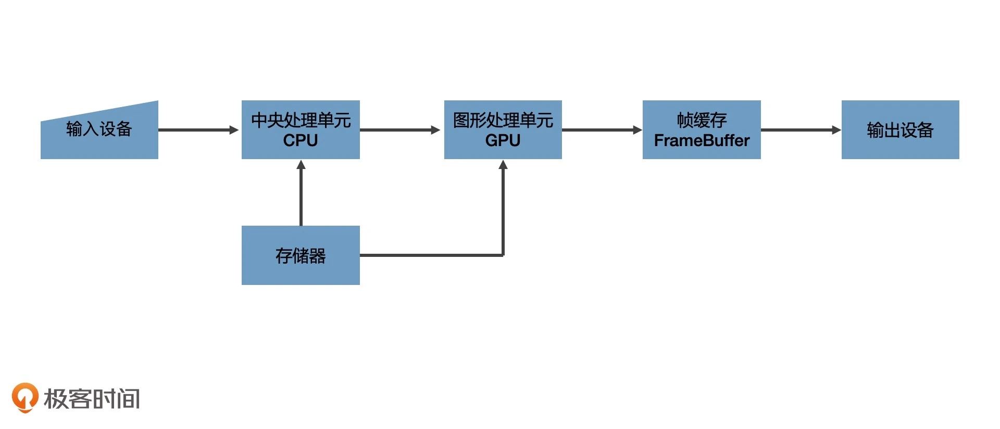
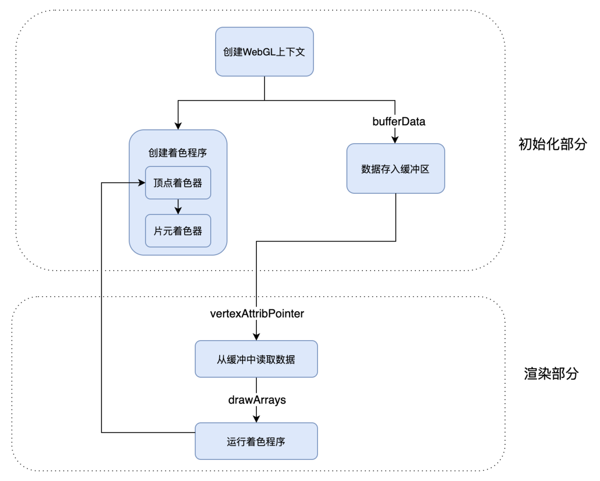

# 04 | GPU 与渲染管线：如何用 WebGL 绘制最简单的几何图形？

[本文代码](./../practice/04.html)

## 图形系统绘图基本原理

一个通用计算机图形系统主要包括 6 个部分：输入设备、中央处理单元、图形处理单元、存储器、帧缓存、输出设备。

- 光栅（Raster）: 几乎所有的现代图形系统都是基于光栅来绘制图形的，光栅就是指构成图像的像素阵列。

- 像素（Pixel）: 一个像素对应图像上的一个点，它通常保存图像上的某个具体位置的颜色等信息。

- 帧缓存（Frame Buffer）: 在绘制过程中，像素信息被存放于帧缓存中，帧缓存是一块内存地址。

- CPU（Central Processing Unit）: 中央处理单元，负责逻辑计算。

- GPU（Graphics Processing Unit）: 图形处理单元，负责图形计算。



图形的绘制过程是一步一步处理的，上一步的输出，是下一步的输入，这样的过程叫**渲染管线(RenderPipelines)**

CPU 和 GPU 都属于处理单元，但是结构不同。

处理图像应用，实际上就是处理计算图片上的每一个像素点的颜色和其他信息。每个像素点相当于一个简单的任务，而一个图片由成千上万个像素点组成。所以我们需要在同一时间处理成千上万个小任务。

要处理这么多的小任务，使用 GPU 是一种更好的方式。

GPU 是由大量的小型处理单元构成的，没有 cpu 强大，但是其数量众多。

WebGL 就是使用 GPU 进行图形绘制的。其同时对每一个像素点进行处理，性能会显得更加高效。

## WebGL 绘制三角形

浏览器提供的 WebGL API 是 OpenGL ES 的 JavaScript 绑定版本，它赋予开发者操作 GPU 的能力。

WebGL 绘图步骤：

1. 创建 WebGL 上下文；
2. 创建 WebGL 程序（WebGL Program）；
3. 将数据存入缓冲区；
4. 将缓冲区数据读取到 GPU;
5. GPU 执行 WebGL 程序，输出结果；

- WebGL 程序是一个 WebGLProgram 对象，它是给 GPU 最终运行的着色器的程序，而不是 js 程序。

要创建 WebGL 程序，要编写两个**着色器（Shader）**，着色器是用 GLSL 这种编程语言写的代码片段。

在绘图的时候，WebGL 是以顶点和图元来描述图形几何信息的。

- 顶点： 几何图形的顶点。
- 图元： WebGL 可直接处理的图形单元，由 WebGL 的绘图模式决定，有点、线、三角形等等。

两段着色器：

1. 顶点着色器（Vertex Shader）: 负责处理图形的顶点信息；可理解为处理顶点的 GPU 程序代码，可以改变顶点的信息。如，顶点的坐标、法线方向、材质等；
2. 片元着色器（Fragment Shader）: 负责处理图形的像素信息；处理光栅化后的像素信息。

顶点处理完成后，WebGL 就会根据顶点和绘图模式指定的图元，计算出需要着色的像素点，然后对它们执行片元着色器程序。对指定图元中的像素点着色。

从顶点着色器和图元提取像素点给片元着色器执行代码的过程，就是生成光栅的过程。叫**光栅化过程**。

_**图元**是 WebGL 可以直接处理的图形单元。_

先将顶点着色器和片元着色器创建的代码片段，创建成 shader 对象，再将这两个 shader 对象关联到这个 WebGL 程序上。然后将 WebGLProgram 对象链接到 WebGL 上下文对象上。最后通过 useProgram 选择启用这个 WebGLProgram 对象。

## WebGL 坐标系

x 轴向右，y 轴向上，z 轴向外。右手坐标系。

WebGL 使用的数据需要用**类型数组**定义，默认格式是 `Float32Array`.这是一种类型化数组（TypeArray）.

**javascript 通常用类型化数组来处理二进制缓冲区。**

```c++
// 三角形三个定点
const points = new Float32Array([
  -1, 1,
  0, 1,
  1, -1
])
```

> 并行处理是 WebGL 程序非常重要的概念

## 顶点着色器

- 两个作用：

1. 通过 gl_Position 设置顶点；
2. 通过定义 varying 变量，向片元着色器传递数据；

传递给片元着色器的佱，会根据片元着色器的像素坐标和顶点像素坐标的相对位置做**线性插值**

- WebGL 绘图流程



---

### 尬记：

- GLSL 语言片段中，语句要加分号；因为是字符串代码片段，字符注意不要拼写错误；
